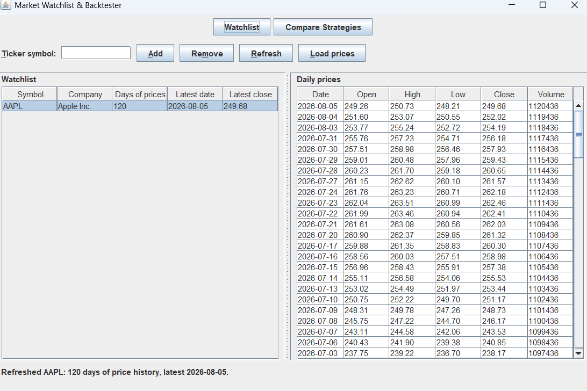

# MarketLens — Market Watchlist & Backtester

## Table of Contents

- [Project Overview](#project-overview)
- [Team Members](#team-members)
- [Features](#features)
- [Technology Stack](#technology-stack)
- [Installation](#installation)
- [Usage](#usage)
- [Project Structure](#project-structure)
- [External APIs](#external-apis)
- [Accessibility](accessibility-report.md)
- [Feedback](#feedback)
- [Contributing](#contributing)
- [License](#license)

---

# Project Overview
Users can create a watchlist of stock tickers, retrieve historical price information, apply trading strategies, and analyze how those strategies would have performed in the past.

The purpose of this application is to help users understand and compare trading strategies through historical simulation without risking real money.

The application supports:
- Managing a personalized stock watchlist
- Retrieving historical market data
- Running trading strategy simulations
- Comparing strategy performance
- Saving your watchlist between sessions

The project is developed for **CSC207: Software Design** at the University of Toronto and follows **Clean Architecture principles**.

---

# Team Members

| Name              | GitHub    | Role | Responsibilities |
|-------------------|-----------|------|------------------|
| Abhirve Munipalle | AbhirveM         | Watchlist & Alpha Vantage Market Data | Manages stock ticker watchlists, validates ticker input, retrieves historical market data from Alpha Vantage, converts API responses into DailyPrice objects, displays historical price data, and handles API/network errors. |
| Ratnabh Khare     | RatnabhK  | Strategy Configuration & Moving Average Strategy | Creates and edits strategy configurations, defines shared strategy interfaces, implements the Moving Average Crossover strategy, validates parameters, generates buy/sell signals, and tests the strategy. |
| Dongyan Zhou      | ZhouDD213 | Momentum Strategy & General Backtesting Engine | Implements the RSI Momentum strategy, validates parameters, generates buy/sell signals, and builds the general backtesting engine to simulate trades and calculate performance metrics such as total return, number of trades, and win rate. |
| Ziyad Mouftah     | mouftz    | Persistence, Strategy Comparison, Main UI & Integration | Handles saving and loading watchlists and strategy configurations, comparing backtest results, building application navigation, connecting modules through the application builder, and performing final integration testing. |

---

# Features

> **Feature status.** This table is the honest summary of what a user can reach in the
> application as it runs today.

| Feature | Status |
|---|---|
| Watchlist management (add / remove / select tickers) | **Runs today** |
| Historical market data from Alpha Vantage, with offline fallback | **Runs today** |
| Watchlist persistence across restarts | **Runs today** |
| Moving Average Crossover strategy | **Runs today** |
| Momentum (RSI) strategy | **Runs today** |
| Backtest engine and performance summary | **Runs today** |
| Strategy comparison screen | **Runs today** |
| Strategy configuration persistence | Not implemented |

## Watchlist Management

Users can:
- Add stock tickers to their personal watchlist
- Remove tickers from their watchlist
- View company information and ticker details
- View recent historical price data

Example:

```
AAPL - Apple Inc.
TSLA - Tesla Inc.
NVDA - NVIDIA Corporation
```

---

## Historical Market Data

The application retrieves historical daily market data including:

- Open price
- High price
- Low price
- Closing price
- Trading volume

Market data is retrieved automatically from an external financial data provider.

---

## Trading Strategy Backtesting

Users can test built-in trading strategies against stocks in their watchlist. On the Backtest
screen, pick a ticker whose price history is loaded and a strategy, then run the backtest.

Both strategies implement a shared `TradingStrategy` contract and produce trading signals from a
`Stock`'s price history.

Two strategies are available:

### Moving Average Crossover Strategy

Signals a buy when the short-term moving average of closing prices crosses above the long-term
average, and a sell when it crosses back below. It runs with a 5-day short window and a 20-day
long window.

### RSI Momentum Strategy

Uses the Relative Strength Index over a 14-day period to flag momentum extremes: a buy when RSI
falls to the oversold threshold (30) or below, and a sell when it reaches the overbought
threshold (70) or above.

> The strategy parameters above are fixed defaults chosen to stay within the free-tier
> ~100-day history limit. They are not yet configurable from the UI.

---

## Performance Analysis

After running a backtest, the results screen shows:

- Simulated trade history
- Buy and sell points
- Individual trade gains/losses
- Total return
- Number of trades
- Win rate

The comparison screen is reachable from the navigation bar and ranks completed backtests against
each other. Run at least one backtest first; until then it shows its empty state.

---

## Data Persistence

The application saves your watchlist — the set of ticker symbols you have added — to a local
`watchlist.dat` file, so your tickers are still there when you reopen the app. The write goes to a
temporary file and is then moved atomically into place, and a corrupted save file is backed up and
recovered from rather than blocking start-up. The window's status bar reports whether each save
succeeded.

Two honest limitations:

- **Strategy configurations are not persisted.** `WatchlistEntry` does not yet carry a strategy
  configuration; wiring that up is tracked in issue #7.
- **Price history is not persisted.** Only ticker membership is saved, so prices are re-fetched
  on demand after a restart. This is deliberate — the free API tier allows roughly twenty-five
  requests a day, and hydrating a restored watchlist automatically would spend them at launch.
  A restored ticker reads as "Not loaded" until you refresh it.

---

# Technology Stack

| Category | Technology |
|----------|------------|
| Programming Language | Java 17+ |
| Build Tool | Maven |
| Testing Framework | JUnit 5 |
| Architecture | Clean Architecture |
| Market Data API | Alpha Vantage |

---

# Installation

## Requirements

Before running the project, install:

- **Java 17 or higher** — [Eclipse Temurin ( Adoptium) downloads](https://adoptium.net/) or `brew install openjdk@17` on macOS
- **Apache Maven** — [Maven install guide](https://maven.apache.org/install.html), or `brew install maven` on macOS (Homebrew must be installed first: [brew.sh](https://brew.sh/))
- **Git** — [git-scm.com/downloads](https://git-scm.com/downloads)

This project runs on any OS with a JDK (Windows, macOS, Linux) — there are no OS-specific dependencies. Installation *commands* differ by OS (e.g. Homebrew is macOS-only); Windows/Linux users should use their platform's package manager or the linked installers above.

Verify installations:

```bash
java -version
mvn -version
git --version
```

---

## Clone the Repository

```bash
git clone https://github.com/AbhirveM/csc207-team-8-final.git

cd csc207-team-8-final
```

---

## Configure API Access

This project uses the [Alpha Vantage API](https://www.alphavantage.co/documentation/) to retrieve market data.

1. Get a free API key: https://www.alphavantage.co/support/#api-key
2. Set it as an environment variable (do **not** hard-code it or commit it to GitHub).

   macOS / Linux:
   ```bash
   export ALPHA_VANTAGE_API_KEY=your_key_here
   ```
   Add this line to your shell profile (`~/.zshrc` or `~/.bash_profile`) to persist it across terminal sessions.

   Windows (PowerShell) — the first line sets it for the current session, the second persists it:
   ```powershell
   $env:ALPHA_VANTAGE_API_KEY = "your_key_here"
   setx ALPHA_VANTAGE_API_KEY "your_key_here"
   ```
   After `setx`, open a new terminal for the change to take effect.
3. The application reads this key at runtime via `System.getenv("ALPHA_VANTAGE_API_KEY")`, at the
   composition root only. There is no `.env` file and no default key in the source.

**This step is optional.** See [Running without an API key](#running-without-an-api-key) — the
application is fully functional offline without one.

⚠️ Never commit your API key. If you accidentally do, rotate it immediately from your Alpha Vantage account.

---

## Build the Project

```bash
mvn clean install
```

## Run Tests

```bash
mvn test
```

To also generate the line-coverage report, run `mvn clean verify` and open
`target/site/jacoco/index.html`.

## Run the Application

Compile, then launch `app.Main` with the `org.json` dependency on the classpath:

```bash
mvn clean compile
```

macOS / Linux:

```bash
java -cp "target/classes:$HOME/.m2/repository/org/json/json/20240303/json-20240303.jar" app.Main
```

Windows (PowerShell) — note the `;` separator rather than `:`:

```powershell
java -cp "target/classes;$env:USERPROFILE\.m2\repository\org\json\json\20240303\json-20240303.jar" app.Main
```

The application runs **without an API key**. If `ALPHA_VANTAGE_API_KEY` is not set, it falls back to
a built-in offline data source with sample history for AAPL, MSFT and TSLA, so the app is fully
usable with no key and no network connection. The status line says so when this fallback is active.

> **Note:** `mvn exec:java` will not work — this project does not declare the `exec-maven-plugin`.
> Use the commands above.

---

## Troubleshooting

**`mvn: command not found`**
Maven isn't installed or isn't on your PATH. Install it (`brew install maven` on macOS) and restart your terminal.

**Compilation errors about a missing class in `entity`**
Someone's feature branch (e.g. a strategy configuration class) likely hasn't merged into `main` yet. Run `git pull` to get the latest `main`, and check open PRs before assuming your local copy is broken.

**`mvn clean install` downloads a lot the first time**
Normal — Maven is fetching dependencies into your local `~/.m2` cache. Subsequent builds are much faster.

**Application throws an error related to the API key**
Confirm the `ALPHA_VANTAGE_API_KEY` environment variable is set in the same terminal session you're running the app from (`echo $ALPHA_VANTAGE_API_KEY` to check).

---

# Usage

1. Set up your API key (optional — see Installation above; the app runs fully offline without one).
2. Launch the application with the `java -cp ...` command in [Run the Application](#run-the-application)
   (`mvn exec:java` is **not** configured for this project).
3. On the Watchlist screen, add stock tickers and load their price history.
4. Open the Backtest screen.
5. Choose a ticker and one of the built-in strategies.
6. Run the backtest.
7. Review the trade history and performance statistics.
8. Open Compare Strategies to rank the backtests you have run.

Example workflow:

```
Add TSLA on the Watchlist screen, then Load prices
        ↓
Backtest screen: choose TSLA + Moving Average Crossover
        ↓
Run backtest
        ↓
View return, trades, and win rate
        ↓
Compare Strategies to rank multiple runs
```

### The Watchlist screen

Add a ticker symbol, and the application resolves the company name and loads its daily price
history. Symbols are normalized (`aapl` becomes `AAPL`), blanks and duplicates are rejected with a
worded explanation, and every provider failure — invalid symbol, network error, quota exhausted —
is reported in text rather than crashing.



The watchlist survives a restart: ticker membership is saved to `watchlist.dat`, while price history
is cached and re-fetched on demand, so a restored row reads "Not loaded" until you refresh it.

### Architecture and design documentation

- [Architecture overview](docs/architecture.md) — the whole-project layer diagram, the Dependency
  Rule, and where each use case sits.
- [Add Ticker — full use case](docs/add-ticker-use-case.md) — class diagram, the Dependency Rule
  applied to this feature, and the before/after views of the screen.
- [Accessibility report](accessibility-report.md) — the seven Principles of Universal Design as
  they apply to MarketLens, our target users, and who may be excluded.
- [Test coverage](plan/handoffs/coverage.md) — what is covered, what is not, and why.

---

# Project Structure

This project follows Clean Architecture.

Structure:

```
src/main/java/
├── entity/
├── use_case/
├── interface_adapter/
├── data_access/
├── view/
└── app/
```

## Entities

Responsible for core business objects, such as:

- Stock ticker
- Historical price data
- Trading strategy
- Backtest results

## Use Cases

Handles application operations, including:

- Adding/removing watchlist items
- Running backtests
- Comparing strategies
- Saving user data

## Interface Adapters

Connects application logic to external interfaces.

Examples:
- Controllers
- Presenters
- View models

## Data Access

Handles persistence — reading and writing watchlist/strategy data to local storage.

## View / App

Handles the Swing user interface and the application's entry point / dependency wiring.

---

# External APIs

## Alpha Vantage

Alpha Vantage provides historical stock market data used by the application. Two endpoints are
called:

- `TIME_SERIES_DAILY` — daily open, high, low, close, and volume data, requested with
  `outputsize=compact`
- `OVERVIEW` — company name and identifying information

Technical indicators are **not** requested from the API; they are computed locally by the strategy
classes from the daily price series.

Documentation: https://www.alphavantage.co/documentation/

### Known limitations

These are properties of the free tier and of the data itself, not defects:

- **Roughly the latest 100 trading days.** `outputsize=compact` returns about 100 daily records;
  full history requires a premium plan. A strategy needs `longWindow + 1` records, so **keep moving
  average long windows at or below about 90** — above that there is not enough history and signal
  generation fails.
- **About 25 requests per day.** Responses are cached in memory to conserve the quota. When the
  limit is reached the application reports it in words rather than failing silently.
- **Prices are unadjusted.** Closing prices are as-traded and are not adjusted for stock splits or
  dividends. A split will appear as a large single-day price jump, which can distort long
  comparisons. This is expected behaviour, not a bug in the strategy calculations.
- **Company names are optional.** `OVERVIEW` returns an empty response for many valid symbols
  (ETFs especially), and it is the first request dropped when the quota runs out. A missing company
  name never blocks adding a ticker — the application falls back to the symbol.

### Running without an API key

If `ALPHA_VANTAGE_API_KEY` is not set, the application uses a built-in offline data source with
deterministic sample history for AAPL, MSFT and TSLA. Every feature works, no network is required,
and no quota is consumed. All automated tests use this path or canned JSON fixtures — **no test ever
calls the live API**.

---

# Feedback

Users can provide feedback by creating a GitHub Issue.

When submitting feedback, include:

- A description of the issue or suggestion
- Steps to reproduce bugs
- Expected behaviour
- Actual behaviour

Useful feedback should be:
- Specific
- Reproducible
- Related to improving the application

---

# Contributing

This is a closed team project for CSC207 coursework — external contributions/forks are not being accepted. Team members follow a branch → pull request → review workflow.

## Creating a Branch

```bash
git checkout main
git pull
git checkout -b feature/short-description
```

## Pull Requests

Before merging:

1. Ensure the project builds successfully (`mvn clean install`).
2. Ensure all tests pass (`mvn test`).
3. Describe the changes made.
4. Request review from another teammate.
5. Address review comments.
6. At least one other team member approves before merging.

Direct commits to `main` should be avoided.

---

# License

This project was created as coursework for:

**CSC207: Software Design**
University of Toronto

All rights reserved — this project is not licensed for external or commercial use. The full terms
are in [LICENSE](LICENSE).

Market data is provided by [Alpha Vantage](https://www.alphavantage.co/) and is subject to their own
terms of service. This project is a learning tool: it does not place trades, hold funds, or
constitute financial advice, and backtested results do not predict future returns.