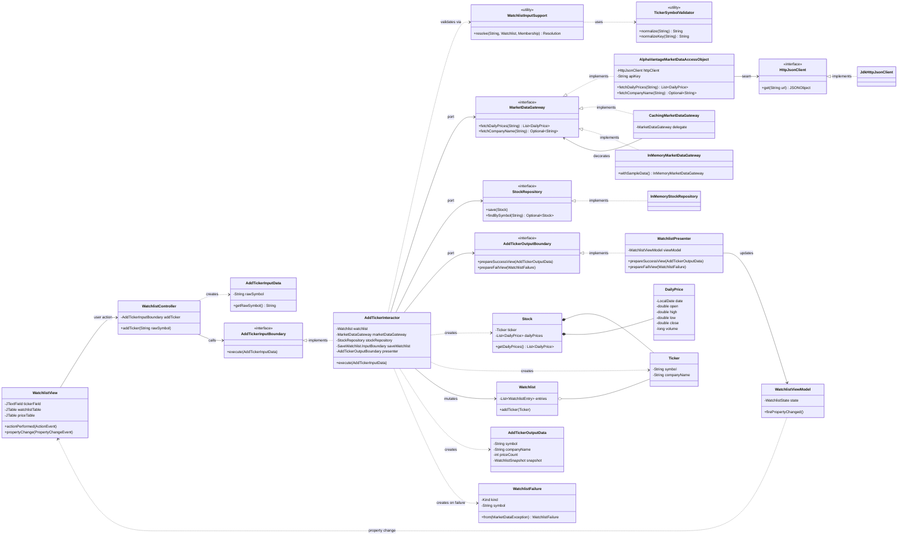
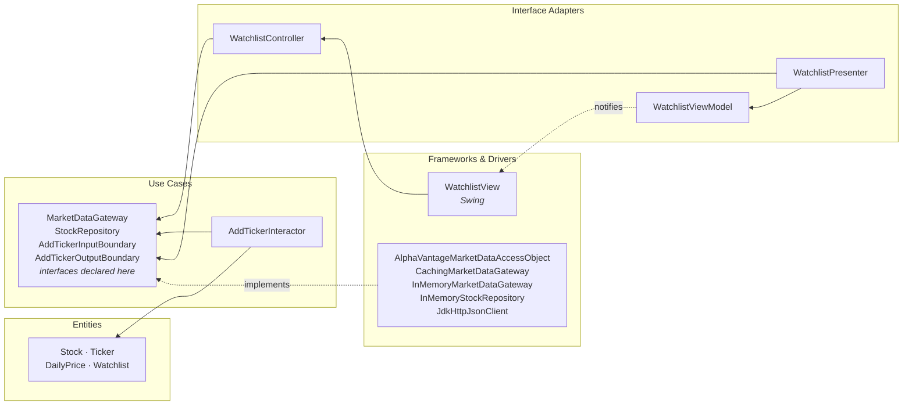
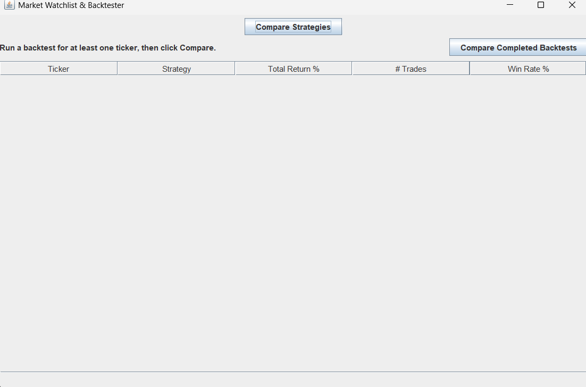

# Add Ticker — Full Use Case

**Owner:** Abhirve Munipalle (Member 1) · **Feature:** Watchlist and Alpha Vantage market data

This is the class diagram for the complete Add Ticker use case, from the Swing view down to the
Alpha Vantage HTTP call, together with the "before" and "after" views of the screen it drives.

---

## Class diagram

---

## The Dependency Rule

The same use case viewed as layers. **Every arrow points inward.** No class in an inner ring names a
class in an outer ring.

**The key move is Dependency Inversion.** `MarketDataGateway` and `StockRepository` are declared in
the **use-case** layer and implemented in `data_access`. The interactor depends only on the port;
`Main` injects the implementation. The compile-time arrow from `data_access` to `use_case` therefore
runs *against* the direction of control flow — which is exactly what the Dependency Rule requires,
and it is why `AddTickerInteractor` knows nothing about Alpha Vantage, HTTP, JSON, API keys or Swing
and can be unit-tested fully offline.

Two consequences worth naming:

- **Substitutability (Liskov / Open-Closed).** Three gateways implement one port. Swapping the live
  Alpha Vantage DAO for the offline fake is a one-line change in `Main` and no other file moves.
  That is how the application runs with no API key and no network.
- **No entity crosses an output boundary.** `AddTickerOutputData` carries only strings and numbers,
  so the view model imports neither Swing nor any entity, and the live internal list returned by
  `Watchlist.getEntries()` can never leak to the view.

---

## Before

The Watchlist feature did not exist. The application launched into the Compare Strategies screen
with an empty results table and no way to add a ticker.

## After

<!-- Capture during the manual walkthrough (plan/handoffs/walkthrough.md step 8) and save as
     docs/after-watchlist-view.png. Show: a ticker added, company name resolved, and the daily
     price table populated. -->

---

## Interactor source

The implementation shown in the presentation is
[`AddTickerInteractor`](../src/main/java/use_case/watchlist/AddTickerInteractor.java). The ordering
inside `execute` is deliberate: validate, reject duplicates, **fetch before mutating**, treat a
missing company name as cosmetic, build the `Stock` (which is where a malformed price series is
rejected — still before any mutation), and only then update the watchlist and save. A provider
failure can never leave a half-added ticker behind.
