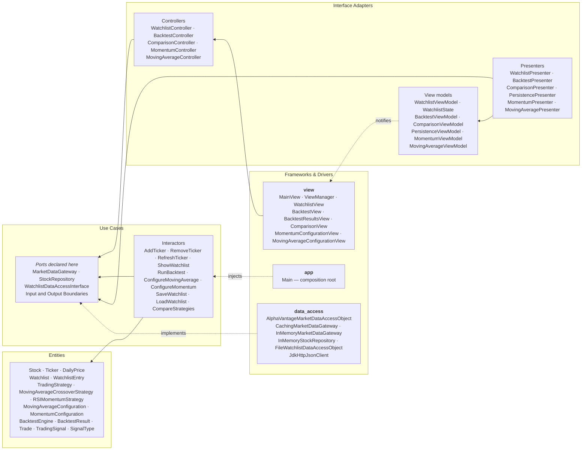

# MarketLens — Architecture Overview

The whole-project view: how the packages map onto Clean Architecture layers, which use cases exist,
where the Dependency Rule holds and where it currently does not, and the design patterns and SOLID
principles the team can point at during the presentation.

Companion diagrams:

- [Use case diagram](use-case-diagram.md) — actors and the ten use cases
- [Entity class diagram](entity-class-diagram.md) — the innermost layer in full
- [Sequence diagrams](sequence-diagrams.md) — runtime call order for three use cases
- [Use cases and edge cases](use-cases-and-edge-cases.md) — every use case, its failure paths, and
  the known gaps
- [Add Ticker — full use case](add-ticker-use-case.md) — one feature end-to-end

---

## 1. Layers

**Every arrow points inward.** The one direction that looks backwards — `data_access` depending on
`use_case` — is the point: the ports are *declared* in the use-case layer and *implemented* outside
it, so the compile-time dependency runs against the flow of control. That is Dependency Inversion,
and it is what lets every interactor be unit-tested with no network, no files and no Swing.

## 2. Package-to-layer map

| Package | Layer | May depend on |
|---|---|---|
| `entity` | Entities | nothing |
| `use_case` | Use Cases | `entity` |
| `interface_adapter` | Interface Adapters | `use_case`, `entity` |
| `view` | Frameworks & Drivers | `interface_adapter` |
| `data_access` | Frameworks & Drivers | `use_case` (ports), `entity` |
| `app` | Composition root | everything — this is where wiring is allowed |

## 3. Use case inventory

All ten use cases are constructed in `Main` and reachable from the running app.

| Use case | Owner | Boundaries | Reachable in the running app |
|---|---|---|---|
| Add Ticker | Member 1 | full | **Yes** |
| Remove Ticker | Member 1 | full | **Yes** |
| Refresh Ticker | Member 1 | full | **Yes** |
| Show Watchlist | Member 1 | full | **Yes** |
| Save Watchlist | Member 4 | nested | **Yes** — called by the watchlist interactors |
| Load Watchlist | Member 4 | nested | **Yes** — called once at start-up |
| Compare Strategies | Member 4 | nested | **Yes** — ranks whatever the backtest screen has filed |
| Run Backtest | Member 3 | full | **Yes** — `BacktestView`, reached from the nav bar |
| Configure Moving Average | Member 2 | full | **Yes** — `MovingAverageConfigurationView` |
| Configure Momentum | Member 3 | full | **Yes** — `MomentumConfigurationView` |

"Nested" means the boundaries are declared as nested interfaces inside a single class
(`SaveWatchlist.InputBoundary`, `CompareStrategies.OutputBoundary`) rather than as the five separate
files the watchlist vertical uses. Those three use cases also pass entities across their boundaries
instead of dedicated input/output data objects — see §4.

The two configuration use cases produce a validated configuration object held in their view models.
`BacktestView` reads those view models for the numbers and passes them through
`BacktestController` as plain `int`s and `double`s — the interactor is what builds the strategy —
falling back to `(5, 20)` for Moving Average and `(14, 30, 70)` for Momentum until the user saves
their own. The configurations
are **not** persisted — see §4.

## 4. Known violations, stated rather than hidden

A grader will run these checks, so we name them ourselves.

No class under `src/main/java` imports against the direction of control any more: the view layer
imports neither `entity` nor `use_case` nor `data_access`, and `entity` and `use_case` import
nothing outward. The five `interface_adapter` classes that import `entity`
(`BacktestPresenter`, `ComparisonPresenter`, `CompletedBacktestStore`, `MomentumPresenter`,
`PersistencePresenter`) point *inward*, which the Dependency Rule allows.

What remains are design smells rather than import-direction violations.

- **Entities cross some boundaries.** The Member-4 use cases declare boundaries that pass `Watchlist`
  and `List<BacktestResult>` directly rather than output-data DTOs. `CompareStrategies` has no input
  data class at all, and its `ComparisonOutputData` exposes public mutable fields. The four watchlist
  use cases are the clean exemplars to compare against.
- **Strategy configurations are never persisted.** The blueprint promises the app saves "the
  watchlist and strategy configurations". `WatchlistEntry.setMovingAverageConfiguration` and
  `setMomentumConfiguration` exist and both configuration classes are `Serializable`, but nothing
  calls either setter — the configurations live only in their view models and are lost on exit.
  They are also global rather than per-ticker, despite `WatchlistEntry` being modelled per-ticker.
- **`BacktestEngine` and the strategies live in `entity`.** Defensible — they are pure domain rules
  with no I/O — but worth being ready to justify.

### Fixed: the view layer no longer imports entities

`BacktestView` used to name eight entity types — `Stock`, `Ticker`, `DailyPrice`,
`TradingStrategy` and both strategy and configuration classes — because the view itself decided
which strategy object to construct, and it read `Stock` and `DailyPrice` out of
`use_case.watchlist.StockRepository`. That crossed from Frameworks & Drivers straight past the
adapter layer. It is fixed: the view now names the strategy by *which* controller method it calls
(`runMovingAverageBacktest` / `runMomentumBacktest`), passes only plain numbers, and the interactor
builds the strategy from a `RunBacktestInputData` factory — the same shape the watchlist screen
already used. Closed by `3183fa1` (PR #49); `ComparisonView` and `BacktestResultsView` were cleaned
earlier in `cca8f63`.

One caveat, so a whole-tree grep holds no surprises: the four watchlist **interactor tests** import
`data_access` implementations. That is test wiring, not production dependency direction — the rule
is about `src/main`, which is clean.

## 5. Design patterns

Beyond anything in the starter code:

| Pattern | Where | Why |
|---|---|---|
| **Strategy** | `TradingStrategy` ← `MovingAverageCrossoverStrategy`, `RSIMomentumStrategy` | New strategies are added without touching `BacktestEngine` |
| **Decorator** | `CachingMarketDataGateway` wraps any `MarketDataGateway` | Adds caching and rate-limit protection without modifying the Alpha Vantage DAO |
| **Observer** | `WatchlistViewModel` → `WatchlistView` via `PropertyChangeListener` | The presenter never holds a reference to Swing |
| **Dependency Injection** | `app/Main` | The composition root is the only place that names concrete implementations |
| **Factory** | `WatchlistSnapshotFactory` | Builds the display snapshot from entities in one place |
| **Adapter / DAO** | `AlphaVantageMarketDataAccessObject`, `FileWatchlistDataAccessObject` | Translate external formats into domain objects |

## 6. SOLID, with concrete evidence

- **Single Responsibility.** `WatchlistView` composes no prose and does no formatting — every value
  arrives display-ready from the presenter. The only string it owns is the `"Error: "` prefix.
- **Open–Closed.** Adding a third strategy requires implementing `TradingStrategy` and changing
  nothing in `BacktestEngine`.
- **Liskov Substitution.** Three classes implement `MarketDataGateway`. Swapping the live DAO for
  the offline fake is one line in `Main`, which is exactly how the app runs with no API key.
- **Interface Segregation.** Each use case declares its own narrow input and output boundary rather
  than sharing one wide interface, so a presenter only implements the callbacks it needs.
- **Dependency Inversion.** Ports declared in `use_case`, implemented in `data_access`. See §1.

## 7. External API — Alpha Vantage

Two distinct remote endpoints are called, both over HTTPS against `https://www.alphavantage.co/query`:

| Request | Purpose | Notes |
|---|---|---|
| `function=TIME_SERIES_DAILY&symbol={SYMBOL}&outputsize=compact` | Daily open/high/low/close/volume history | `compact` returns roughly the last 100 trading days |
| `function=OVERVIEW&symbol={SYMBOL}` | Company name for the watchlist row | A miss is treated as cosmetic, never as a failure |

The API key is read only from the `ALPHA_VANTAGE_API_KEY` environment variable, is never logged, and
is never committed. When it is absent the application falls back to `InMemoryMarketDataGateway`
with deterministic sample history for AAPL, MSFT and TSLA, so the program is fully usable offline.

**Free-tier limits** — roughly 25 requests per day. This drives two design decisions: price history
is never hydrated automatically at start-up, and "Load prices" refreshes one ticker at a time and
stops the moment the provider reports the limit is reached.
