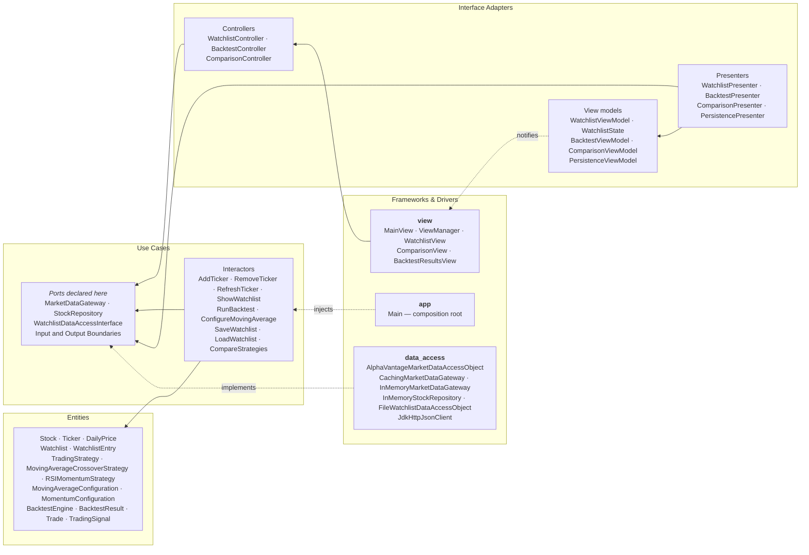

# MarketLens — Architecture Overview

The whole-project view: how the packages map onto Clean Architecture layers, which use cases exist,
where the Dependency Rule holds and where it currently does not, and the design patterns and SOLID
principles the team can point at during the presentation.

For a single feature end-to-end, see [Add Ticker — full use case](add-ticker-use-case.md).

---

## 1. Layers

**Every arrow points inward.** The one direction that looks backwards — `data_access` depending on
`use_case` — is the point: the ports are *declared* in the use-case layer and *implemented* outside
it, so the compile-time dependency runs against the flow of control. That is Dependency Inversion,
and it is what lets every interactor be unit-tested with no network, no files and no Swing.

## 2. Package-to-layer map

| Package | Layer | May depend on |
|---|---|---|
| `entity` | Entities | nothing |
| `use_case` | Use Cases | `entity` |
| `interface_adapter` | Interface Adapters | `use_case`, `entity` |
| `view` | Frameworks & Drivers | `interface_adapter` |
| `data_access` | Frameworks & Drivers | `use_case` (ports), `entity` |
| `app` | Composition root | everything — this is where wiring is allowed |

## 3. Use case inventory

| Use case | Owner | Boundaries | Reachable in the running app |
|---|---|---|---|
| Add Ticker | Member 1 | full | **Yes** |
| Remove Ticker | Member 1 | full | **Yes** |
| Refresh Ticker | Member 1 | full | **Yes** |
| Show Watchlist | Member 1 | full | **Yes** |
| Save Watchlist | Member 4 | nested | **Yes** — called by the watchlist interactors |
| Load Watchlist | Member 4 | nested | **Yes** — called once at start-up |
| Compare Strategies | Member 4 | nested | Screen reachable; empty until backtests can run |
| Run Backtest | Member 3 | full | **No — not constructed in `Main`** |
| Configure Moving Average | Member 2 | interactor only | **No — no presenter, controller, view model or view** |
| Configure Momentum | — | none | **No — entity only, no use case** |

## 4. Known violations, stated rather than hidden

A grader will run these checks, so we name them ourselves.

- **`view` imports `entity`.** `ComparisonView` and `MainAppState` both import
  `entity.BacktestResult`, which crosses from Frameworks & Drivers straight past the adapter layer.
  The fix is a display-ready DTO on `ComparisonViewModel`, the same shape `WatchlistState` already
  uses for the watchlist screen.
- **`MainAppState` is a mutable global singleton.** Its own javadoc calls it a temporary integration
  seam. It exists because the backtest and comparison features were built by different members in
  parallel and needed somewhere to meet. It should be replaced by passing results through the
  comparison view model.
- **Entities cross some boundaries.** The Member-4 use cases declare boundaries that pass `Watchlist`
  and `List<BacktestResult>` directly rather than output-data DTOs. The four watchlist use cases are
  the clean exemplars to compare against.
- **`BacktestEngine` and the strategies live in `entity`.** Defensible — they are pure domain rules
  with no I/O — but worth being ready to justify.

## 5. Design patterns

Beyond anything in the starter code:

| Pattern | Where | Why |
|---|---|---|
| **Strategy** | `TradingStrategy` ← `MovingAverageCrossoverStrategy`, `RSIMomentumStrategy` | New strategies are added without touching `BacktestEngine` |
| **Decorator** | `CachingMarketDataGateway` wraps any `MarketDataGateway` | Adds caching and rate-limit protection without modifying the Alpha Vantage DAO |
| **Observer** | `WatchlistViewModel` → `WatchlistView` via `PropertyChangeListener` | The presenter never holds a reference to Swing |
| **Dependency Injection** | `app/Main` | The composition root is the only place that names concrete implementations |
| **Factory** | `WatchlistSnapshotFactory` | Builds the display snapshot from entities in one place |
| **Adapter / DAO** | `AlphaVantageMarketDataAccessObject`, `FileWatchlistDataAccessObject` | Translate external formats into domain objects |

## 6. SOLID, with concrete evidence

- **Single Responsibility.** `WatchlistView` composes no prose and does no formatting — every value
  arrives display-ready from the presenter. The only string it owns is the `"Error: "` prefix.
- **Open–Closed.** Adding a third strategy requires implementing `TradingStrategy` and changing
  nothing in `BacktestEngine`.
- **Liskov Substitution.** Three classes implement `MarketDataGateway`. Swapping the live DAO for
  the offline fake is one line in `Main`, which is exactly how the app runs with no API key.
- **Interface Segregation.** Each use case declares its own narrow input and output boundary rather
  than sharing one wide interface, so a presenter only implements the callbacks it needs.
- **Dependency Inversion.** Ports declared in `use_case`, implemented in `data_access`. See §1.

## 7. External API — Alpha Vantage

Two distinct remote endpoints are called, both over HTTPS against `https://www.alphavantage.co/query`:

| Request | Purpose | Notes |
|---|---|---|
| `function=TIME_SERIES_DAILY&symbol={SYMBOL}&outputsize=compact` | Daily open/high/low/close/volume history | `compact` returns roughly the last 100 trading days |
| `function=OVERVIEW&symbol={SYMBOL}` | Company name for the watchlist row | A miss is treated as cosmetic, never as a failure |

The API key is read only from the `ALPHA_VANTAGE_API_KEY` environment variable, is never logged, and
is never committed. When it is absent the application falls back to `InMemoryMarketDataGateway`
with deterministic sample history for AAPL, MSFT and TSLA, so the program is fully usable offline.

**Free-tier limits** — roughly 25 requests per day. This drives two design decisions: price history
is never hydrated automatically at start-up, and "Load prices" refreshes one ticker at a time and
stops the moment the provider reports the limit is reached.
