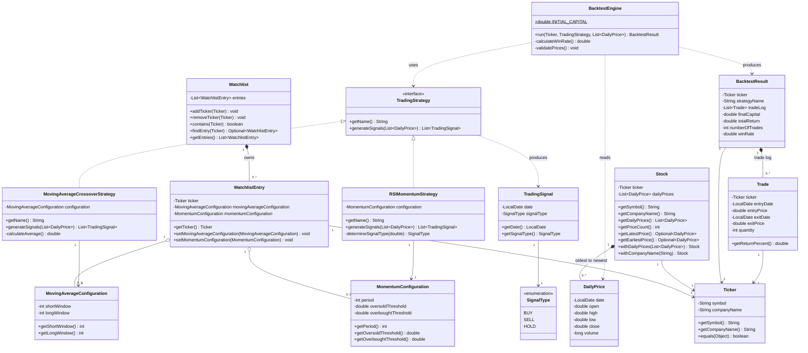

# MarketLens — Entity Class Diagram

The innermost Clean Architecture layer: the 15 classes in `entity`, their fields, and their
relationships. Nothing here depends on any other package in the project.

## What the diagram shows

**The Strategy pattern is the centrepiece.** `BacktestEngine` depends only on the `TradingStrategy`
interface, never on either implementation. A third strategy is added without touching the engine —
this is the clearest Open/Closed example in the project.

**Configuration is separated from behaviour.** `MovingAverageConfiguration` and
`MomentumConfiguration` hold validated parameters and nothing else; the strategies hold the
algorithm. Each configuration is supplied through its strategy's constructor, per the blueprint's
shared `TradingStrategy` contract.

**Two aggregates, one shared identity.** `Watchlist → WatchlistEntry` models *membership*;
`Stock → DailyPrice` models *market data*. They meet only at `Ticker`. That separation is what lets
the save file contain membership without ever containing price history.

**Composition vs aggregation is deliberate.** Filled diamonds (`*--`) mark ownership with a shared
lifetime — a `WatchlistEntry` has no meaning outside its `Watchlist`, and a `Trade` has none outside
its `BacktestResult`. Hollow diamonds (`o--`) mark the optional configurations, which outlive any
single entry.

## Serialization

`Serializable`: `Ticker`, `Watchlist`, `WatchlistEntry`, `DailyPrice`, `Trade`, `TradingSignal`,
`BacktestResult`, `MovingAverageConfiguration`, `MomentumConfiguration`.

**`Stock` is deliberately not `Serializable`** — price history is never persisted, so the save file
format is unaffected by market data. A restored ticker shows "Not loaded" until refreshed, which is
also quota protection.

> **Known gap.** `Watchlist`, `Ticker` and `DailyPrice` declare no `serialVersionUID`, so any future
> field change alters the JVM's computed UID and turns every existing save file into an
> `InvalidClassException` — which `FileWatchlistDataAccessObject` treats as corruption and silently
> resets. `WatchlistEntry`, `Trade` and both configuration classes do declare one.

## Deviations from the blueprint's shared contracts

Appendix A of the project blueprint fixed these shapes across the team. Two have drifted:

- **`BacktestResult` has no `initialCapital` field.** The contract specifies "initial/final capital".
  In practice the initial capital is the constant `BacktestEngine.INITIAL_CAPITAL` ($10,000), so
  nothing is *wrong*, but a consumer cannot read it off the result — which is why reconstructing an
  equity curve requires reaching for the engine constant.
- **`Trade` has no `profitOrLoss` accessor.** The contract lists "profit or loss, and percentage
  return"; only `getReturnPercent()` exists. Absolute profit is derivable from entry/exit price and
  quantity, but every caller has to derive it.

`Trade` also names its fields `entryDate`/`entryPrice`/`exitDate`/`exitPrice` where the blueprint
says `purchaseDate`/`purchasePrice`/`saleDate`/`salePrice`. Same meaning, different vocabulary.
