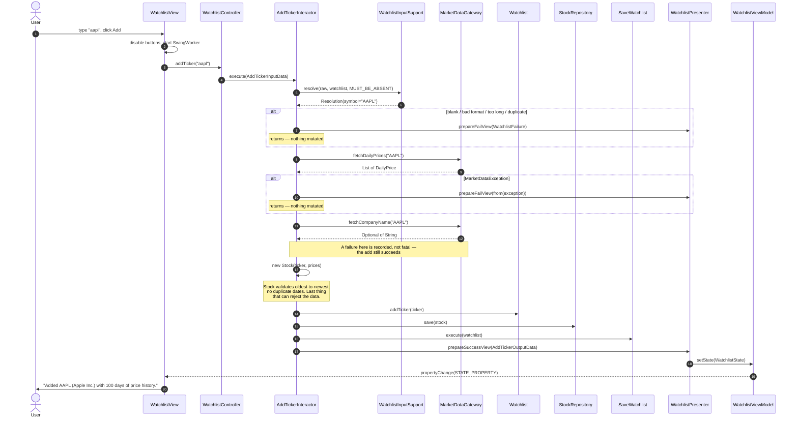
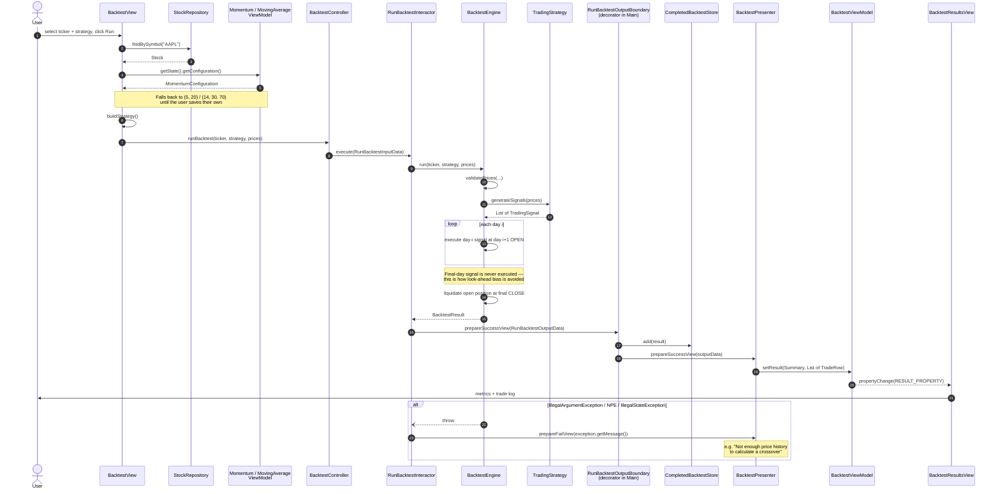
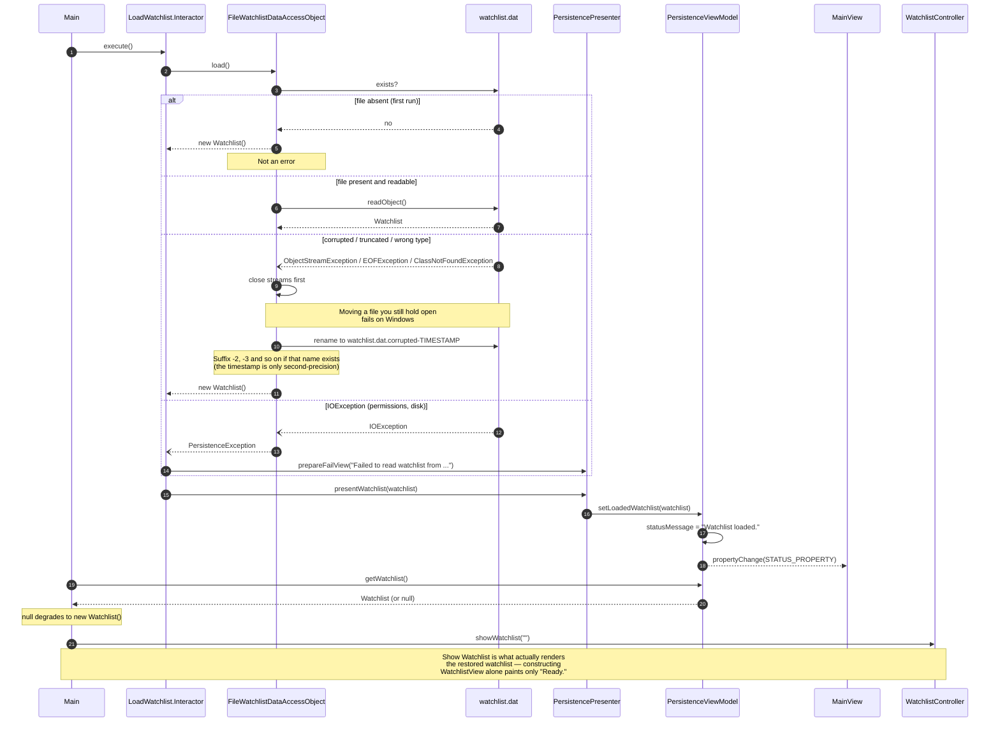

# MarketLens — Sequence Diagrams

Runtime call order through the Clean Architecture layers for three representative use cases: one
from each member's vertical, chosen because each shows something the class diagrams cannot.

- [Add Ticker](#add-ticker) — why ordering is a correctness property
- [Run Backtest](#run-backtest) — how two features meet without referencing each other
- [Load Watchlist](#load-watchlist-start-up) — corruption recovery

---

## Add Ticker

The order of the first four interactor steps is load-bearing: **every failure path returns before
anything mutates.**

**What to point at.** Both gateway calls and the `Stock` construction happen *above*
`watchlist.addTicker` — everything that can fail runs before the first mutation. So a network error,
a rate limit or a malformed price series can never leave a half-added ticker behind. Building the
`Stock` before touching the watchlist extends that guarantee to the validation failure too, since
`Stock`'s constructor is the last thing that can reject the provider's data.

**Where it is imperfect.** `saveWatchlist.execute(...)` returns `void` and the interactor never
checks it, so a failed save still reaches `prepareSuccessView`. The user sees "Added AAPL…" in the
watchlist panel and "Could not save watchlist: …" in the window's status bar at the same moment.

---

## Run Backtest

**What to point at.** The decorator hop is the whole integration story. `RunBacktestInteractor` calls one
`RunBacktestOutputBoundary`; the object behind it is an anonymous decorator built in `Main` that
files the result into `CompletedBacktestStore` before delegating to the presenter. **The backtest
feature does not know a comparison feature exists, and vice versa** — they meet only at that one
instance. Decorating the boundary rather than putting the `add` call inside `BacktestPresenter` is
what keeps that true.

Second point: engine and strategy exception messages are forwarded to the user *verbatim*. That is
why the guard messages read as sentences rather than developer shorthand.

**Where it is imperfect.** Everything above `runBacktest(...)` happens inside `BacktestView`, which
imports eight entity types and constructs strategy objects itself — the project's remaining
Dependency Rule violation. The whole sequence also runs on the event dispatch thread, with no
`SwingWorker`, unlike Add Ticker.

---

## Load Watchlist (start-up)

The richest failure handling in the project. Note there is no user actor — this runs once before
the window is visible.

**What to point at.** Corruption never blocks the user from opening the app: the bad file is backed
up and a fresh watchlist is returned. But a backup that *fails* throws rather than proceeding —
the DAO refuses to silently reset data it could not preserve. The collision suffix exists because
the backup timestamp is only second-precision, and a backup that clobbers the previous backup is
no backup.

**Where it is imperfect.** Three things worth owning:

1. On the `IOException` path, `Main` substitutes an empty watchlist and continues — and the next Add
   or Remove calls Save, which writes that empty watchlist over the real file. There is no "don't
   save until load succeeded" flag.
2. Corruption recovery is **silent**. The presenter is only reached on the throwing paths, so
   nothing in the UI ever says a backup was made.
3. `Main` reaches into a view model (`persistenceViewModel.getWatchlist()`) to retrieve an entity,
   rather than receiving it through the output boundary.
