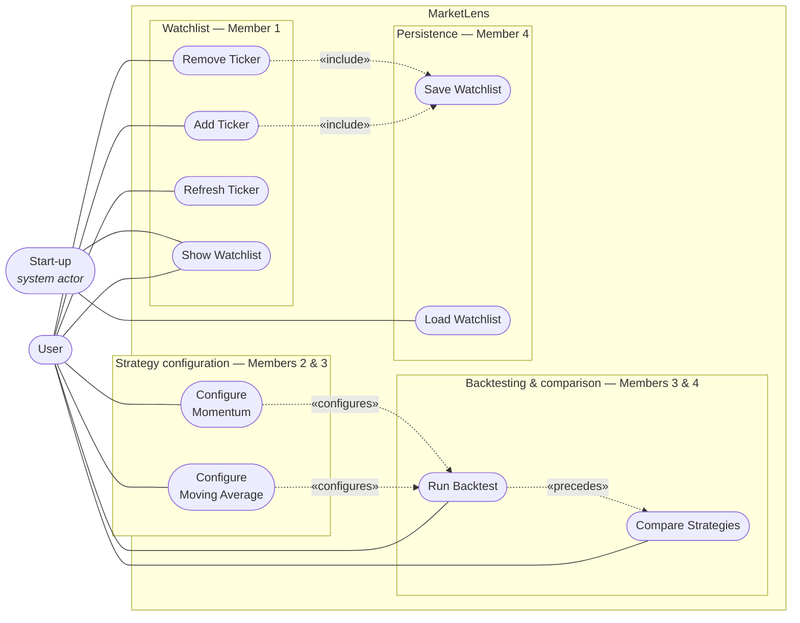

# MarketLens — Use Case Diagram

The ten use cases, who triggers them, and how they relate. For the layer view see
[Architecture overview](architecture.md); for the classes behind one use case see
[Add Ticker](add-ticker-use-case.md).

> **Notation note.** Mermaid has no first-class UML use-case syntax, so use cases are drawn as
> stadium nodes rather than literal ovals. Everything else follows UML: actors outside the system
> boundary, association lines from actor to use case, and «include» for a use case that always
> invokes another.

## Reading the diagram

**Two actors.** The user drives eight use cases directly. **Save Watchlist** and **Load Watchlist**
have no UI control at all — Save is always invoked by Add and Remove, and Load runs once at
start-up. Modelling start-up as a system actor is what makes that visible rather than hidden.

**Show Watchlist has two triggers.** A row click, and once at start-up after Load — constructing
`WatchlistView` alone paints only the initial empty state, so a watchlist restored from disk would
not render until the user's first action.

**«include» vs the weaker edges.** Add and Remove *always* invoke Save, which is a true UML
`include`. The other two dashed edges are weaker and are **not** invocations:

- **«precedes»** — Compare Strategies ranks only backtests that already finished in this session, so
  Run Backtest must happen first. Nothing in `CompareStrategies` calls `RunBacktest`; they meet only
  through `CompletedBacktestStore`.
- **«configures»** — Run Backtest reads whatever configuration the user last applied, falling back to
  `(5, 20)` and `(14, 30, 70)`. Configuring is therefore optional, and `RunBacktestInteractor` never
  calls a configuration use case.

**Refresh deliberately does not include Save.** Refreshing changes prices, not watchlist
membership, and prices are never persisted.

## Use case summary

| Use case | Actor | Package | Boundaries |
|---|---|---|---|
| Add Ticker | User | `use_case.watchlist` | full |
| Remove Ticker | User | `use_case.watchlist` | full |
| Refresh Ticker | User | `use_case.watchlist` | full |
| Show Watchlist | User, Start-up | `use_case.watchlist` | full |
| Configure Moving Average | User | `use_case.moving_average` | full |
| Configure Momentum | User | `use_case.momentum` | full |
| Run Backtest | User | `use_case.backtest` | full |
| Compare Strategies | User | `use_case.comparison` | nested |
| Save Watchlist | *(included by Add / Remove)* | `use_case.persistence` | nested |
| Load Watchlist | Start-up | `use_case.persistence` | nested |

"Full" means the five-file boundary set (`InputBoundary`, `InputData`, `Interactor`,
`OutputBoundary`, `OutputData`). "Nested" means the boundaries are declared as nested interfaces
inside one class — see [Architecture overview §4](architecture.md).

**Not use cases.** `MarketDataGateway`, `StockRepository`, `WatchlistDataAccessInterface`,
`TickerSymbolValidator`, `WatchlistInputSupport`, `WatchlistFailure`, `WatchlistSnapshot` and
`WatchlistSnapshotFactory` live under `use_case/` but are ports and support types, not use cases.
They are deliberately absent from the diagram.
